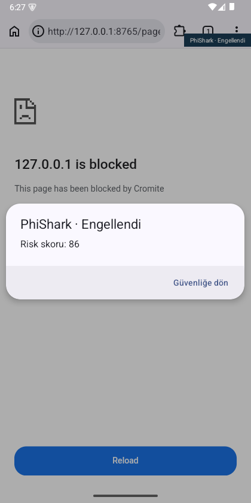
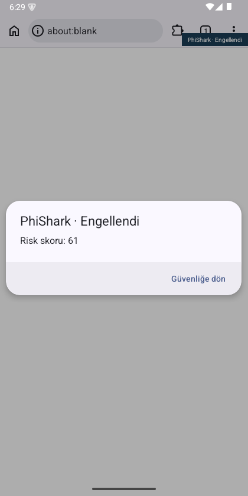
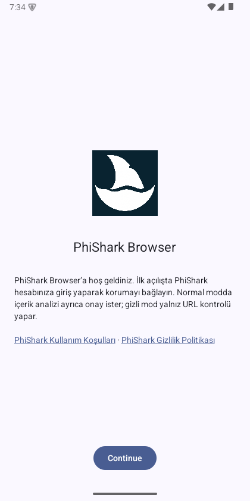
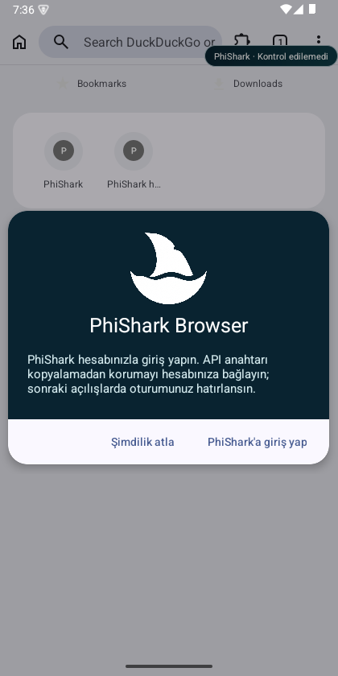

# Android build and emulator evidence

Reviewed 2026-10-09. A successful compile is separate from an application launch.
This report does not certify PhiShark Browser or production API protection.

## Unmodified pinned ARM64 build

The pinned Chromium/Cromite source built `chrome_public_apk` and
`chrome_public_bundle` on Ubuntu 24.04 under WSL, with the upstream release GN
arguments, matching pinned PGO profiles and `target_cpu="arm64"`.
The build reported `Build Succeeded: 59981 steps` after 3h7m06s.

| Artifact | SHA-256 |
| --- | --- |
| Local ARM64 ChromePublic.apk | `36cc3434c27d8f154c658f3b20b3304d51d3f26bd260acf0a183b4f38b1a693e` |
| Local ARM64 ChromePublic.aab | `c5c2393039d747b11c6acc73b5832be4352ae00b844496a1ba3a9c9226b47328` |
| Universal APK generated from that AAB | `be3518c315f531c3e66ed5903e967c4fd36d004340427d0e68d5be20e6c007ce` |

Artifacts are kept outside Git in the Linux build workspace, with task-local
Windows copies for installation. They use Chromium's development signing key,
not a PhiShark release key. Package: `org.cromite.cromite`, version:
`153.0.8010.37`. No PhiShark navigation hooks are present in these artifacts.

## Windows emulator comparison

The integrated, fixture-disabled ARM64 build subsequently completed in 44m38.20s
(9,431 incremental steps). This is the pre-account overlay (`d1e55122`), signed with
the development key, package `io.phishark.browser`; physical launch is unverified.
Immutable artifacts are in the build workspace's `artifacts/phishark-arm64-pre-account`:
APK SHA-256 `54a16810e5fef6884b3c97702735788bf4d0ea5858e680c9d5d594c06b6c3f41`,
AAB SHA-256 `0b0918c2f184b805fbe5c7cee5fe7abdf752bde4a1ebfca9eaa0adddd972f387`.
They do not include the subsequent account onboarding or complete brand update.

The task-local Android Emulator 37.3.3 runs the official Android 15/API 35 Google
APIs x86_64 r09 image on WHPX. The emulator advertises ARM64 translation.
Only synthetic fixture data is used; the production PhiShark API is not called.

| Artifact | Installation | Observed launch |
| --- | --- | --- |
| Official pinned Cromite x64 APK | Passed | Passed; local fixture page opened |
| Locally compiled unmodified ARM64 APK | Passed; Android reports `arm64-v8a` | Failed: immediate SIGSEGV |
| Locally generated ARM64 universal APK | Passed | Failed: immediate SIGSEGV |
| Official pinned Cromite ARM64 APK | Passed | Failed: same JNI exception path |
| Locally compiled unmodified x64 APK | Passed | Passed; first-run completed and local fixture page rendered |
| First PhiShark x64 fixture APK | Passed | Launched; initial preflight failed because Cromite's firewall denied its new annotation. Superseded by the corrected artifact below |
| Corrected PhiShark x64 fixture APK | Passed | Passed; preflight/deep blocking and private URL-only smoke checks passed |

The original ARM64 APK and official ARM64 package both fail when a host JNI
exception crosses the translated guest's `FindClassHook`. Local symbolization
identifies `base::android::FindClassHook` and Android locale-resource lookup.
The universal APK encounters the same hook during a Java filesystem operation.
This comparison supports an ARM translation compatibility issue; it does not
prove that the ARM64 artifacts run correctly on a physical Android device.

The official comparison APKs are diagnostic inputs, never PhiShark releases:

- Official x64 SHA-256: `f63e0c8e97a1796a82d1d2c18ae13115e5a88184e3911b43f903884fe358306a`.
- Official ARM64 SHA-256: `9db12af1af021f42b4371e76d0e9fe476a7085bbbbc76bc410a538d028bf6071`.

The native x64 baseline passed on this Windows emulator. Its build command is:

```bash
bash android/scripts/run-baseline.sh /absolute/Linux/build-root x64
```

It uses a separate `out/phishark_x64_baseline` directory and
`baseline-x64.log`; ARM64 outputs and original sources are preserved. Upstream
launch passed before applying navigation/branding modifications. The final
resumed build segment completed 29,979 actions in 1h39m37s; this excludes earlier
interrupted/resumed work. Local artifacts were copied to an immutable baseline
directory before reusing the output directory for PhiShark:

- x64 APK SHA-256: `42c24b917e36a6739681e8395430a3b93b7666f3f370589c01cafbecdcc36709`.
- x64 AAB SHA-256: `6956baee9dd67979befa0f1d33a4b783e9bd941f001e5a669236c4f756c0545d`.

The observed first-run and local HTTP page render establish baseline launch only.
The PhiShark overlay was subsequently applied to a `codex/` branch in the
external checkout; GN generation passed for `io.phishark.browser`, with the
synthetic fixture mode enabled. The integrated APK subsequently passed the basic
checks below; full device acceptance remains incomplete.

## Prepared integration verification

The overlay C++ source has compiled against the actual pinned Chromium ARM64
command, JNI generator and Android headers, with upstream warning/plugin checks.
The Java bridge and vault compiled against the actual Chromium classpath and SDK.
These compiler checks do not run a navigation or prove screenshot privacy.
The overlay was applied after the local x64 baseline launch.
`apply-integration.py --dry-run` validates all 21
copy/edit targets without mutating Chromium.

The first in-tree integration build caught two source-path-sensitive checks that
the external compatibility compile did not enforce: fixture-key pointer
arithmetic and an inline complex constructor. The fixture now uses bounded
iterators; `NavigationSession` has an out-of-line constructor compiled into both
Chromium and the independent policy test. Actual in-tree compilation of the
navigation throttle and verdict source then passed with upstream checks enabled.
The 42 native vectors/invariants and eight JS tests passed again. The compatibility
helper must not be treated as an equivalent replacement for the in-tree build.

The first integrated x64 APK/AAB built successfully and the APK launched as
`io.phishark.browser`, label `PhiShark Browser`. APK SHA-256:
`d5769240cdb49e62a660adf8a7dbeb595286d6f01e673711c2f3aa8f6ea019b8`;
AAB SHA-256: `0191ca83f02290e26f4650cfd1591e3a44f791cfd63c210dc29fe943b0b598a0`.
These first artifacts are superseded for testing: their preflight-block fixture
loaded with an unverified badge; counters were zero preflights and one blocked
scenario page GET. Inspection identified Cromite's default-deny browser-process
firewall. The applier now registers only the PhiShark annotation and allow rule;
the generated decoder maps it to `allowed=true`, leaving other rules intact.
The rebuilt APK passed the repeated on-device checks recorded below.
The first-run title/icon were corrected; upstream ad-filter privacy links and
attribution remain visible. The obsolete Cromite APK-update checkbox still appears
on first run even though the updater controller is disabled; remove it before release.

## Corrected PhiShark device smoke evidence

The corrected x64 fixture APK and AAB built successfully (final incremental build:
446 actions, 7m06s), and the APK installed/launched on the task-local API 35 emulator.

- APK SHA-256: `5814d36cbc86060b69198697118202f7a611c36e9c75a39eb1adf90524189fb2`.
- AAB SHA-256: `348736b30ff8761c9e0f9d7a20ca71f7b9466b0d2532f74fca9f51c7ebc35847`.
- Package `io.phishark.browser`; label `PhiShark Browser`; ABI `x86_64`.
- Development signing and synthetic loopback-only fixture mode; these are not store artifacts.

| Observed native check | Evidence |
| --- | --- |
| Preflight score 86 | Native blocked dialog; one API preflight, zero page GETs for the blocked scenario |
| Deep score 61 | One page GET followed by one deep request; document replaced by `about:blank`; native blocked dialog without a continue action |
| Return to safety | Both blocked dialogs returned to the new-tab page |
| Private URL-only | Opened the same deep-block scenario in a private tab; total preflights rose from 2 to 3 while deep requests stayed at 1; URL-only badge and page remained visible |
| Synthetic capture privacy | The normal deep request passed the fixture checks for removed form/editable/frame/shadow markers and absent Cookie/Authorization headers; privacy rejection count stayed at zero |

The private-tab check deliberately does not establish a deep verdict. These few
fixture checks do not certify real-provider detection, consent revocation,
screenshots, redirect/restore/BFCache coverage, cross-tab coalescing, all error
paths or everyday browser behavior. ARM64 integration build has since passed
with the pre-account overlay; physical Android validation and iOS/Mac validation
remain pending. The subsequent account/branding overlay replaces product labels
and hides the upstream update checkbox; its validation is recorded separately.





The actual `ApiKeyVault` source also passed a separate Android instrumentation
test on this emulator: initially 16, now 23 assertions across two different processes, including
encrypted persistence after process restart, absence of plaintext in the stored
file, fresh AES-GCM nonces, tamper rejection, invalid format rejection, key size
limits, separate account/pending/key storage purposes and deletion of both file and Keystore alias. The test-only package
`io.phishark.browser.vaulttests` has no Internet permission and uses synthetic
data. This verifies the storage component, not the integrated browser, and does
not establish hardware-backed Keystore behavior on a physical device.

Build with `python3 android/scripts/build-vault-tests.py /absolute/Linux/build-root/src`.
Install the resulting `.build/vault-device-tests/PhiSharkVaultTests.apk`, then run
the following commands in order against the test emulator:

```bash
adb -s emulator-5554 shell am instrument -w -e phase prepare io.phishark.browser.vaulttests/io.phishark.browser.vaulttests.VaultInstrumentation
adb -s emulator-5554 shell am instrument -w -e phase verify io.phishark.browser.vaulttests/io.phishark.browser.vaulttests.VaultInstrumentation
```

Native fixture evidence must subsequently establish preflight cancellation
before page GET, redirect rechecks, deep warning/block behavior, private URL-only
operation, capture sanitization, error classification and stale-result rejection.
Fixture `/stats` counts only known synthetic scenario names and numeric events
in memory. It stores no URL or page evidence. An unchanged `preflight-block`
page GET count is the concrete test for preventing that document request.

## Account and PhiShark branding build

The final x64 fixture APK/AAB at browser source `8308008b` built successfully.
APK SHA-256: `78809f489e3441877ee8aba2a033f3caa81d78b3a0313a75cb93fcf92ad38e41`.
AAB SHA-256: `402768d244b67c2658fcef3fe05434a2373edb241013259e907a5e4af4e4a41c`.
Both are development-signed and include the opt-in local fixture capability.

On the same API 35 x86_64 emulator the final APK installed, launched and completed
the welcome/search-provider steps. The official PhiShark launcher mark, welcome
copy/legal links, native account pairing dialog and two PhiShark factory new-tab
suggestions were visually verified. These screenshots use an empty test profile.
The former Chromium sample tiles and updater checkbox are absent. Search engine
brands and upstream legal credits remain intentional. The native security badge
uses PhiShark colors and a short state-transition fade; ordinary browser
animations remain upstream.

The initial AAB attempt caught the callback activity declared outside the chrome
split; placing it inside upstream's application-definitions macro fixed bundle
manifest/dex sanity checks. The final APK and AAB both passed packaging.

No live account was connected. Backend/dashboard account routes are pushed in
review branches but not deployed. Real PKCE callback, expired-token refresh,
server revocation, offline recovery, large-text/dark-mode UI and physical ARM64
acceptance remain required. The earlier security fixture observations above were
made on the prior APK and must not be treated as end-to-end account validation.
The ARM64 artifact above predates account/branding changes.




